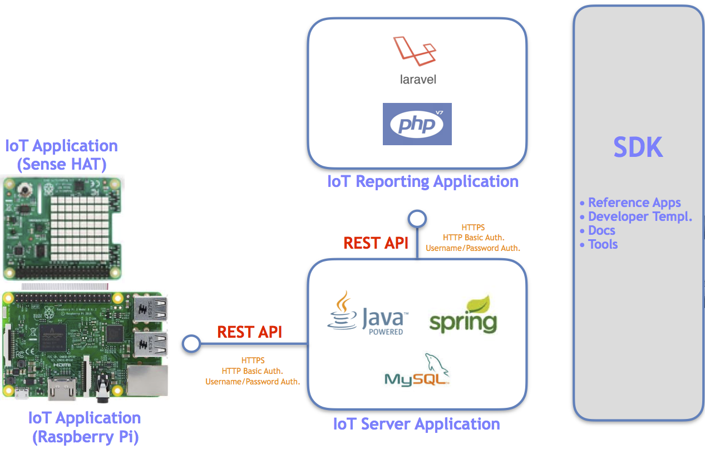

**Getting Started Building the IoT Apps**
==================
The Cloud Workshop SDK contains all the documentation and sample template applicationsrequired to build a simple, scalable, Cloud based suite of IoT applications. The following assumes you have setup Github, Codenvy, and OpenShift accounts.

Get the SDK and Code
--------------------

To get started building the IoT Template apps please perform the following steps. The Template projects are starter projects contains all the scaffolding Java Spring Maven files and all the scaffolding PHP Laravel files to enable you to start building "working" applications. These starter projects can be used as a baseline when building your IoT set of applications. You will first need to create a Github account if you do not have one already. All application code should be maintained in the Github Cloud based source control system because code deployed to the Codenvy Cloud IDE and OpenShift PaaS Cloud both uses Github as the source repository. 

 1. [Clone the SDK](https://github.com/markreha/cloudworkshop) to your local file system.
 2. Create two repositories 'cloudservices' and 'cloudapp' in your Github account.
 3. Copy all of the files from the SDK ***/sdk/developer/templates/cloudservices*** folder to your Github 'cloudservices' repository. Note, bulk file upload can be done in Github using your browser but you must use the Chrome browser.
 4. Copy all of the files from the SDK ***/sdk/developer/templates/cloudapp*** folder to your Github 'cloudapp' repository. Note, bulk file upload can be done in Github using your browser but you must use the Chrome browser.
 5. Create local GIT repositories using the Sourcetree GIT Client using the Github repositories created in the previous steps. Make sure your local GIT repositories are configured properly to manage hidden files (via .gitignore file) so that hidden files are also uploaded.

To get started building the IoT Reference apps please perform the following steps. The Reference apps are fully working IoT applications that you can build and modify as desired.

 1. [Clone the IoT Cloud Services Reference app ](https://github.com/markreha/cloudservices) to your local file system. [Clone the IoT Cloud Reporting Reference app ](https://github.com/markreha/cloudapp) to your local file system.
 2. Create two repositories 'cloudservices' and 'cloudapp' in your Github account.
 3. Copy all of the files from the cloned IoT Cloud Services Reference app to your Github 'cloudservices' repository. Note, bulk file upload can be done in Github using your browser but you must use the Chrome browser.
 4. Copy all of the files from the cloned IoT Cloud Reporting Reference app to your Github 'cloudapp' repository. Note, bulk file upload can be done in Github using your browser but you must use the Chrome browser.
 5. Create local GIT repositories using the Sourcetree GIT Client using the Github repositories created in the previous steps. Make sure your local GIT repositories are configured properly to manage hidden files (via .gitignore file) so that hidden files are also uploaded.

Other documents located in this directory that you need to review and reference include:

* Codenvy and OpenShift Setup Notes - Cloud Setup Notes.txt
* Codenvy Tomcat / MySQL Stack Recipe - Codeenvy Custom Tomcat MySQL Stack Recipe.txt
* Codenvy PHP Workspace Recipe - Codenvy CloudApp Recipe.txt
* Codenvy Tomcat / MySQL Workspace Recipe - Codenvy CloudServices Recipe.txt
* OpenShift Getting Started Guide - OpenShift_Online-3-Getting_Started-en-US.pdf *

You can now use the steps outlined below for setting up your development environment and building the IoT Template applications or building the IoT Reference applications.

Setup your Java MySQL Development Environment
--------------------
It is recommended to use the Cloud based Codenvy IDE as your development environment. This saves you from all the time and complexity of setting up Eclipse, MySQL, and Tomcat in your local environment. However, if you wish, the Template and Reference apps have been built and validated in both the Codenvy IDE and Eclipse IDE so you are also free to setup a local development environment using Eclipse, MySQL, and Tomcat. You will also want to reference the [Cloud Setup Notes](Cloud%20Setup%20Notes.txt) in the SDK.

Codenvy Setup Instructions:
 1. Log onto Codenvy. 
 2. Click on the Stacks menu from the left Main Menu.
 3. Scroll down to the Java-MySQL stack and click the 'Duplicate stack'
 4. Click on the newly created Java-MySQL stack to edit the stack configuration. In the Name field rename your new stack to 'Java-MySQL-Workshop' (no quotes). Under the Runtimes click under the Machines on the 'Down arrow' icon for the DB. Change the Source field from 'eclipse/mysql' to 'kaloyanraev/mysql-no-volume' (no quotes). This will change the Docker image to an image that works around a bug in the default image where the MySQL database is not maintained during the image snapshotting (and losses all data in the database).
 5. Click the Test button to validate your new stack. Make sure both the Tomcat 'dev-machine' and the MySQL 'db' environments all started without errors. This can be done by looking at the two respective terminal console output at the bottom of the Codenvy IDE.
 6. Click the Save button.
 7. Click on the Workspaces menu from the left Main Menu.
 8. Click the Add Workspace button.
 9. In the Workspace name field rename the Workspace to 'cloudservices' (no quotes).
 10. Select the Runtime icon.
 11. Select the Java-MySQL-Workshop runtime.
 12. Click the Save button.
 13. It is also recommended that you install the Postman Chrome Plugin and MySQL Admin Chrome Plugin.

Eclipse Neon and MySQL Setup Instructions:
 1. Install Eclipse EE Neon. Start Eclipse and create a new empty Workspace. 
 2. Click on the Servers tab. Click on the 'create new server' link.
 3. Select Tomcat 8.5 under the Apache section. Click the Next button.
 4. Click the Browse button and navigate to the root directory of the Tomcat installation. Click the Next button.
 5. Click the Finish button. The new Tomcat server should be listed in the Servers tab.
 6. Click the Start icon to validate that the Tomcat server starts and runs without errors.
 7.  Start MySQL Workbench and connect MySQL Workbench to your local MySQL database to ensure that you can connect to the database.
 
Setup your PHP Development Environment
--------------------
It is recommended to use the Cloud based Codenvy IDE as your development environment. This saves you from all the time and complexity of setting up Eclipse and MAMP in your local environment. However, if you wish, the Template and Reference apps have been built and validated in both the Codenvy IDE and Eclipse IDE so you are also free to setup a local development environment using Eclipse, and MAMP. You will also want to reference the [Cloud Setup Notes](Cloud%20Setup%20Notes.txt) in the SDK.

Codenvy Setup Instructions:
 1. Log onto Codenvy. 
 2. Click on the Workspaces menu from the left Main Menu.
 3. Click the Add Workspace button.
 4. In the Workspace name field rename the Workspace to 'cloudapp' (no quotes).
 5. Select the Runtime icon.
 6. Select the PHP runtime.
 7. Click the Save button.

Eclipse Neon and MAMP Setup Instructions:
 1. Install Eclipse PHP Neon. Start Eclipse and create a new empty Workspace. 
 2. Install MAMP.

Build the IoT Services App
--------
The following steps can be used to configure and build the IoT Services app. You will also want to reference the [Cloud Setup Notes](Cloud%20Setup%20Notes.txt) in the SDK for how to setup the database and command tools in Codeny as well as setup PHP auto deployment in your local Eclipse PHP environment.

Codenvy Build Instructions:

 1. Start/open your 'cloudservices' Workspace. 
 2. Once the environment is up and running click the 'Import Project...' link in the left project pane. 
 3. Select the GITHUB option under the Source Control section. Enter the URL for your Github 'cloudservices' repository. Click the Import button.
 4. Select the Java Project Configuration and click the Next button.
 5. Click the Save button.
 6. Setup your MySQL Database. Select the Workspaces menu from the left Main Menu in Codenvy. Select your Workspace. Under the Workspace Runtime configuration expand the DB Machine,  scroll down to the Servers section, and note the address DB URL in the dbserver-3306-tcp entry. This address (URL hostname and port) will be used in MySQL Workbench OR MySQL Admin Chrome Plugin.  Log into  MySQL Workbench or MySQL Admin as root user (username of root and password of root) and then run the IoT.sql DDL script located in the ***docs\database*** folder within the SDK. You will also need to set the privileges for the *iot* schema for the pet clinic user (username of petclinic and password of password).
 7. Setup the Commands below by selecting the Commands tab (far left under the Projects tab in the Project pane). You can create a new Command by clicking the + icon next to the Command Category. These Custom Commands should be added under the Common Commands.
 8. To build and run the project invoke the following commands from the Custom Commands:
	 - Run 'Start Tomcat' to start the Tomcat Server.
	 - Run 'Build and Deploy' to do a clean Maven build and deployment to the Tomcat Server.
 
**Maven Build and Deployment Command**
 Command Name: 
 	<pre>Build and Deploy</pre>
 Command Line:
	<pre>mvn clean package -f ${current.project.path} -Pdev
	echo Deploying ${current.project.path}/target/cloadservices.war to $TOMCAT_HOME/webapps/cloudservices.war ......
	cp ${current.project.path}/target/cloadservices.war $TOMCAT_HOME/webapps/cloudservices.war
	echo Deployed ${current.project.path}/target/cloadservices.war</pre>
Preview Url: 
		<pre>http://${server.port.8080}/${current.project.relpath}</pre>

**Start Tomcat Command**	
Command Name: 
	<pre>Start Tomcat</pre>
Command Line:
	<pre>$TOMCAT_HOME/bin/catalina.sh jpda run 2>&1</pre>
Preview Url: 
		<pre>http://${server.port.8080}/${current.project.relpath}</pre>

**Stop Tomcat Command**
Command Name:
	<pre>Stop Tomcat</pre>        
 Command Line:
	 <pre>$TOMCAT_HOME/bin/catalina.sh stop</pre>
Preview Url: 
	<pre>None</pre>
NOTE: you should create a backup of the Workspace and environment by selecting the Workspace Config tab within your workspace, select all the configuration text from the edit control, and save this to a standard text file. You can put this Codenvy Recipe under source control (recommended). If your Workspace every becomes corrupt (Codevny has a bug where your Custom Commands set are not snapshotted) you can always use this Recipe to create a new Workspace.

----------

Eclipse Build Instructions:
 1. Setup your MySQL Database. Log into MySQL Workbench as root user (username of root and password of root) and then run the IoT.sql DDL script located in the ***docs\database*** folder within the SDK. You will also need to set the privileges for the *iot* schema for the pet clinic user (username of petclinic and password of password).
 2. Make sure your MySQL database is running.
 3. Open your Eclipse 'cloudservices' Workspace.
 4. Import the 'cloudservices' Template app from the SDK or the 'cloudservices' Reference app from the cloned repository. This can be done by selecting the File->Import menu options in Eclipse, under the General section select the 'Existing Projects into Workspace' open, navigate to the root of the SDK to import the Template app or navigate to one folder higher than were the 'cloudservices' repository was cloned to, **make sure you check the 'copy' checkbox when importing**, and click the Finish button.
 3. To build and run the project invoke the following:
	 - Build the Project by selecting the Run->Run As->Maven Build and then set the name to My Cloudservices Build, set the Goals to clean deploy, set the Profiles to dev, and click the Run button.
	 - Add the Project to your Tomcat Server. This can be done by right clicking on the Tomcat Server in the Servers tab and adding the 'cloudservices' project to the Configured section. Your should also make sure you use the /cloudservices path for your web module. This can be done by double clicking on the Tomcat Server in the Servers tab, selecting the Modules tab from the Server configuration page, adding or editing the cloudservices Web Module.
	 - From the Servers tab click the Start icon for Tomcat to start the Tomcat Server.

Build the IoT Reporting App
--------
To build in Codenvy:

 1. Start your 'cloudapp' Workspace. Once the environment is up and running click the 'Import Project...' link in the left project pane. 
 2. Select the GITHUB option under the Source Control section. Enter the URL for your Github 'cloudapp' repository.
 3. Click the Import button.
 4. Select the PHP Project Configuration and click the Next button.
 5. Click the Save button.
 6. In order for Laravel to run properly requires some file level permissions to be setup and the Apache configuration updated to allow HTTP filters to be run. The following needs to be done only once and the first time you run your PHP environment:
 7. To run the project invoke the following (you must do the one time configuration in next step):
 	 - Run 'Start Apache' from the Command Tools
 8. Fix permissions on Codenvy (one time setup issue): 
	 - Run the following in Codenvy Terminal: sudo find /projects/cloudapp -type d -exec chmod 777 {} \;
	 - Fix up .htaccess for Laravel project by updating apache2.conf:
	 -- cd /etc/apache2
	 -- sudo chmod 777 apache2.conf
	 -- sudo apt-get install nano
	 -- nano apache2.conf
	 -- Scroll down to to Virtual Directorys for /project and set AllowOverride to All
	 -- Restart Apache

----------

To build in Eclipse Neon:

 1. Open your Eclipse 'cloudapp' Workspace.
 2. Import the 'cloudapp' Template app from the SDK or the 'cloudapp' Reference app from the cloned repository. This can be done by selecting the File->Import menu options in Eclipse, under the General section select the 'Existing Projects into Workspace' open, navigate to the root of the SDK to import the Template app or navigate to one folder higher than were the 'cloudapp' repository was cloned to, **make sure you check the 'copy' checkbox when importing**, and click the Finish button.
 3. You can setup an ANT build file to automatically copy files from your Workspace to your MAMP runtime *htdocs* directory (i.e. auto-deployment). For examples, see the 'build.properties and 'build.xml' files from the Reference App and the documentation in the ***developer/eclipsePHP*** directory in the SDK.

----------

Next Steps
--------
After you are able to build Template applications you are then ready to start customizing the applications functionality as per your own IoT requirements or per the functionality implemented in the Reference applications. Remember, all code should be maintained in the Github Cloud based source control system because code deployed to the Codenvy Cloud IDE and OpenShift PaaS Cloud both uses Github as the source repository.

[Back to Top](#getting-started-building-the-iot-apps)

----------

Deploy the IoT Services App to OpenShift
--------
Once you have tested your IoT Services app you can then setup Cloud Containers in OpenShift and then build and deploy your application to OpenShift. Your IoT Services should FIRST be regression tested using the Postman Test Scripts located in the ***/sdk/developer/testing*** directory in the SDK before building and deploying your application. You may have to customize the hostnames and ports in the Test Scripts from the SDK. You will also want to reference the [Cloud Setup Notes](Cloud%20Setup%20Notes.txt) in the SDK.

NOTE: You will need to Create two OpenShift v3 accounts: use one account for the IoT Services application and another account for the IoT Reporting application.

Setup and configure the OpenShift JBoss Tomcat MySQL Container:
 1. Create a new Project in OpenShift named GCU Cloud Workshop.
 2. Click the Add to Project menu.
 3. Add the following types to the Project: JBoss Tomcat 8 image for the REST API Spring project and when prompted for a Github Repository URL for your project enter the URL for your 'cloudservices' Github repository.
 4. Click the Add to Project menu.
 4. Add the following Data Store to the Project: MySQL datastore image for the MySQL database.
 5. Once you have added both Containers to your Project you will need to group the JBoss Tomcat Container with the MySQL Container.

Initialize the MySQL Database (also see the online help [here](https://docs.openshift.com/online/dev_guide/migrating_applications/database_applications.html)):
 1. Download the OpenShift Command Line Interface tool from [here](https://console.starter-us-east-1.openshift.com/console/command-line).
 2. Open a Terminal Window or DOS Box. 
 3. Navigate to the path were the Command Line Tool was installed. 
 4. Get the MySQL Pod Name: ./oc get pods
 5. Copy the IoT.sql DDL script from SDK into a directory called /local/db on your local file system.
 6. Copy the SQL DDL script to the OpenShift MySQL Pod: ./oc rsync /local/db <mysql_pod_name>:/var/lib/mysql/data
 7. Remote into the MySQL Pod: ./oc rsh <mysql_pod> 
 8. Run the command: cd /var/lib/mysql/data
 8. Run the SQL DDL Script: mysql -u root
 9. Run the command: source all.sql
 9. Grant privileges to petclinic user: grant all privileges on iot.* to petclinic
 10. Run the command: flush privileges

NOTE: Because you will not have enough quota during deployment you will need to change the Container deployment strategy for this project. This can be done by selecting the following menu options: click Applications -> Deployments main menu items, select the name of your application, select the Actions -> Edit drop down menu options, and change the Deployment Strategy Type from Rolling to Recreate.

Build and deploy your application:
 1. Select the Builds->Builds main menu items. Click on the name of your JBoss Tomcat Container.
 2. Click the Start Build button. Note, you can monitor your build by clicking on the View Log link. Validate that your build was successful.
 3. Click the Overview main menu item. Note, you can monitor the build and deployment from this
    screen.

[Back to Top](#getting-started-building-the-iot-apps)

Deploy the IoT Reporting App to OpenShift
--------
Once you have tested your IoT Reporting app you can then setup Cloud Containers in OpenShift and then build and deploy your application to OpenShift. You will also want to reference the [Cloud Setup Notes](Cloud%20Setup%20Notes.txt) in the SDK.

NOTE: You will need to Create two OpenShift v3 accounts: use one account for the IoT Services application and another account for the IoT Reporting application.

Setup and configure the OpenShift PHP Container:
 1. Create a new Project in OpenShift named GCU Cloud Workshop.
 2. Click the Add to Project menu.
 3. Add the following types to the Project: PHP 7.0 image for PHP Laravel project. When prompted for a Github Repository URL for your project enter the URL for your 'cloudapp' Github repository.

Build and deploy your application:
 1. Select the Builds->Builds main menu items. Click on the name of your PHP Container.
 2. Click the Start Build button. Note, you can monitor your build by clicking on the View Log link. Validate that your build was successful.
 3. Click the Overview main menu item. Note, you can monitor the build and deployment from this
    screen.

[Back to Top](#getting-started-building-the-iot-apps)
