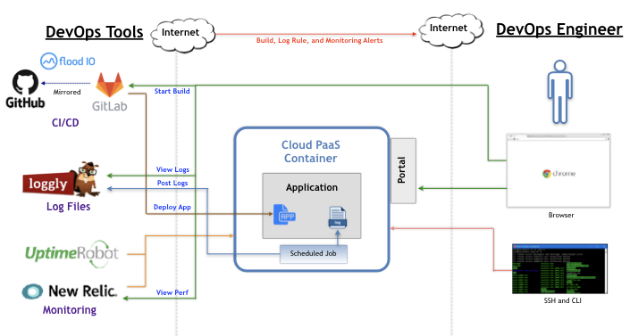

**DevOps Reference Architecture**
==================
Some principles of DevOps are demonstrated in the IoT Reference Applications. The following diagram illustrates where DevOps principles are demonstrated in the [Cloud Workshop SDK](https://github.com/markreha/cloudworkshop/blob/master/README.md).

**Tutorials and Resources:**
 - https://www.tutorialspoint.com/devops_tutorials.htm
 - https://www.guru99.com/devops-tutorial.html
 - http://www.devopsschool.com
 - https://dzone.com/devops-tutorials-tools-news

**Logging, Monitoring, and Alerts:**
 - Logging:
	 - The IoT Services Application demonstrates logging using SLF4J with the Log4J logging provider. See the sample code located in the SDK for examples how to configure SLF4J and Log4J into your application.
	 - The DevOps Reference Architecture demonstrates the use of Loggly as a free Log Analysis Tool. See the [DevOps Setup Notes](DevOps%20Setup%20Notes.txt) for details on how to integrate Loggly into your application.
	 - Depending on your Cloud Platform these log files can be accessed or pulled for analysis.
	 - The following briefly outlines how to access log files for each of the Cloud Platforms supported by the SDK:
	 - - *OpenShift*: To view the Application Server log file from the Portal, select your Application from the Application->Deployments menu and then click the View Log menu. To view the Application Logs from the Portal, select your Application from the Application->Pods menu and then click the Terminal menu. From the Terminal tail your log file.
	 - - *Google*: To view the Application Server log, Application log, or stdout from the Portal, select your Project and then the App Engine->Versions menu and then click the Logs option from the dropdown Tools menu. To view  the Application log from the Portal, select your Project and then the App Engine->Instances menu, and then SSH into the server to tail your log file.
	 - - *Azure*: To view the Application Server log, Application log, or stdout from the Portal, select your Project and then the Advanced Tools menu, select the Tools->Zip Push Deploy menu options, navigate to the log file, and click the View menu. You must set the logging configuration to log to stdout.
	 - - *Heroku*: To view the Application Server log, Application log, or stdout from the Portal, select your application, select the View Logs menu. You must set the logging configuration to log to stdout.
 - Monitoring:
	 - Application Performance Management (APM): 
		 - To monitor your application performance you can use a product, such as New Relic or AppDynamics. Both of these products are available as "free" add-ons in the Heroku Cloud. Other options include using Stackdriver on Google Cloud or enabling Monitoring Alert rules in Azure Cloud.
	 - Application Availability: 
		 - To be notified that your application is not running you can use a free service such as Uptime Robot (at https://uptimerobot.com). This service will monitor a URL of your application and notify via email is your application is not running. For the IoT Reporting Application you can simply test access by using the Root URL. For the IoT Services Application you can simply test access by using the Test URL (at /rest/weather/test) or the root URL of application. he DevOps Reference Architecture demonstrates the use of Uptime Robot as a free Application Availability Tool. See the [DevOps Setup Notes](DevOps%20Setup%20Notes.txt) for details on how to integrate Uptime Robot into your application.
 - Alerts:
	 - In an ideal DevOps design your log files would be pushed to a platform like Splunk or Loggly (at https://www.loggly.com) where rules and alerts could be setup. The DevOps Reference Architecture demonstrates the use of Loggly and has setup 2 alerts. See the [DevOps Setup Notes](DevOps%20Setup%20Notes.txt) for details on how to integrate this into your application.
	 - In an ideal DevOps design your APM (Application Performance Monitor) tool and your Availability Monitoring tool would generate alerts if there were issues with your application.

**Continuous Integration/Continuous Deployment:**
 - Automation Testing:
	 - Unit Testing:
	 -- Unit tests can be written, such as JUnit, and invoked via your Maven POM file configuration during the Test Phase in GitLab or Jenkins.
	 - Performance Testing:
	 - - Performance tests can be written, such as JMeter, and invoked from a free Cloud based provider like Flood IO (at https://flood.io/) during the Test Phase in GitLab or Jenkins.
	 - Functional Testing:
	 - - There are not any known free Cloud based providers that support functional testing.
 - GitLab CI/CD Pipeline: 
	 - The IoT Reporting Application and the IoT Services Application each have an example CI/CD configuration file in the SDK (i.e. .gitlab-ci.yml) that demonstrates how CI/CD is integrated using GitLab. It should be noted that the current GitLab Pipeline is setup for manual builds however simply changing the CI/CD configuration from manual to auto could automate your build and deployment.
	 - The example CI/CD configuration file in the SDK provides examples how to build the PHP application via Composer or the Java Spring application via Maven using a GitLab project that mirrors GIT repositories located on GitHub.
	 - The example CI/CD configuration file in the SDK provides examples how to deploy the PHP application or the the Java Spring application to the OpenShift, Azure, Google, and Heroku Cloud Platforms using a GitLab project that mirrors GIT repositories located on GitHub.
	 - To start using GitLab create a new Project, mirror your GitHub repository (or use GitLab as your GIT repo), add a .gitlab-ci.yml to the root of your project (using the examples in the SDK as a guide), setup any Environment Variables (located in the Settings->CI/CD->Variables menu options), and finally create a Pipeline (located in the CI/CD->Pipelines menu options). See the [DevOps Setup Notes](DevOps%20Setup%20Notes.txt) for details on how to integrate GitLab into your application.
	 - The DevOps Reference Architecture demonstrates the use of Loggly as a free Log Analysis Tool. See the [DevOps Setup Notes](DevOps%20Setup%20Notes.txt) for details on how to integrate Loggly into your application.
 - Jenkins CI/CD Pipeline:
	 - It is possible from Openshift to deploy a Jenkins container. Another option is to download Jenkins (at https://jenkins.io/download/) and install Jenkins yourself either as a WAR file on a local instance of Tomcat or JBoss Wildfly. The following instructions outline the steps to setup a build job on Jenkins in support of a GIT Push Build to Heroku:

<ol type="n">
  <li>Create a New Item, name your Jenkins Project, select the Freestyle Project type, and click the OK button</li>
  <li>Configure a Build</li>
       <ul>
            <li>Under Source Code Management Section check the Git option.</li>
            <li>In the Repository URL enter the GitHub Repo URL. This is will be your source clone repo.</li>
            <li>Click the Add Repository button.</li>
            <li>In the Repository URL enter the Heroku Repo URL. Add credentials of [Heroku Username]/[Heroku API Key]. Click the Advanced button and enter heroku as the Name. This is will be your remote push repo.</li>
            <li>nder the Build Section click the the 'Add build step' dropdown and the 'Execute shell' option. Enter any custom bash commands to support the build. See the [DevOps Setup Notes](DevOps%20Setup%20Notes.txt) for example build scripts.</li>
            <li>Under the Post-build Actions section click the 'Post post-build action' dropdown and the 'Git Publisher' option. Check the 'Push Only If Build Succeeds' option and 'Force Push' option. In the Branches enter master for the Branch to push and heroku as the Target remote name.</li>
           <li>Click the Save button.</li>
       </ul>
  <li>Start a Build</li>
       <ul>
            <li>From the Jenkins Dashboard select your Project.</li>
            <li>Click the Build Now button.</li>
       </ul>
</ol>
